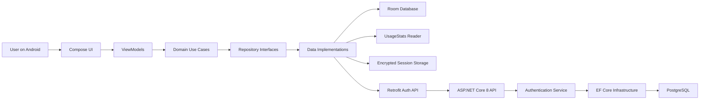

# Architecture

## Overview

LifeLogger AI uses a local-first Android client and a cleanly separated backend.

## Android Modules

- `app`: application entry point, WorkManager setup, navigation
- `core:common`: shared coroutine and formatting utilities
- `core:model`: pure models
- `core:database`: Room entities, DAO, database
- `core:datastore`: encrypted session storage and app preferences
- `core:network`: Retrofit/OkHttp auth client
- `core:domain`: repository contracts and use cases
- `core:data`: repository implementations and UsageStats ingestion
- `core:ui`: theme and reusable composables
- `feature:auth`: register/login UI and state
- `feature:timeline`: daily timeline UI and state

## Backend Layers

- `LifeLogger.Api`: Minimal APIs, Swagger, auth middleware, startup
- `LifeLogger.Application`: contracts and service abstractions
- `LifeLogger.Domain`: entities
- `LifeLogger.Infrastructure`: EF Core, auth services, background cleanup

## Phase 1 Data Flow

1. User registers or logs in from the Android app.
2. Backend issues an access token and refresh token.
3. Android stores the active session securely.
4. Timeline screen checks whether Usage Access is granted.
5. `UsageStatsReader` reads foreground/background usage events.
6. Repository replaces the current day's `activity_logs` in Room.
7. Compose renders a timeline and top-app summary from Room `Flow`.
